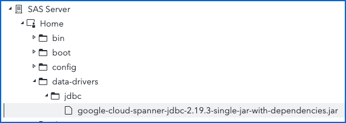

# Spanner

## Introduction

Spanner is a fully managed, mission-critical database service that offers transactional consistency at global scale, automatic, synchronous replication for high availability, and support for two SQL dialects: GoogleSQL (ANSI 2011 with extensions) and PostgreSQL.

## Resources

- [Spanner Documentation](https://cloud.google.com/spanner/docs/)
- [Spanner JDBC Drivers](https://cloud.google.com/spanner/docs/jdbc-drivers)

## Prerequisites

***Note: we assume here that the Spanner database to access is configured with the Google Standard SQL dialect. For a Spanner database configured with the PostgreSQL dialect, see Access a PostgreSQL dialect database.***

Before you can connect to Spanner through JDBC from SAS Viya, you need to have the following:

1. Access to a Spanner instance and database (Google Standard SQL dialect) with a Service Account credentials file.

2. [Spanner JDBC Driver](https://cloud.google.com/spanner/docs/jdbc-drivers) from Google.

***Note: there seems to be two drivers available to connect a Google Standard SQL dialect database. However the links to download the Simba version are broken.***

3. Working installation of SAS Viya.

**To install the JDBC driver:**

1. Download the Spanner JDBC driver from this [site](https://cloud.google.com/spanner/docs/jdbc-drivers).

   - Click on **Maven Central** > **Versions** > **Browse** (on the latest version, 2.19.3 at the time these instructions were written). You should land to a page similar to [this](https://repo1.maven.org/maven2/com/google/cloud/google-cloud-spanner-jdbc/2.19.3/).

   - Download the biggest file with a name corresponding to google-cloud-spanner-jdbc-X.XX.X-single-jar-with-dependencies.jar

2. Copy the JDBC driver in /data-drivers/jdbc according to the [instructions](https://support.sas.com/documentation/installcenter/viya/SASViyaReadMe.htm#139721599534704specify-external-jdbc-drivers) provided by SAS.

   

## Overview

| Spanner                    |                                                                                   |
| -------------------------- | --------------------------------------------------------------------------------- |
| **Company URL**            | https://cloud.google.com/spanner                                                  |
| **JDBC JAR File Path**     | [google-cloud-spanner-jdbc-2.19.3-single-jar-with-dependencies.jar](https://repo1.maven.org/maven2/com/google/cloud/google-cloud-spanner-jdbc/2.19.3/google-cloud-spanner-jdbc-2.19.3-single-jar-with-dependencies.jar) |
| **JDBC URL Syntax**        | jdbc:cloudspanner:/projects/\<project\>/instances/\<instance-name\>/databases/\<database-name\>?credentials=\<credentials-file-path\>;lenient=true |
| **Default Port**           | N/A                                                                               |
| **JDBC Driver Class Name** | com.google.cloud.spanner.jdbc.JdbcDriver                                          |

## Setting up the connection

This section provides step-by-step instructions on how to set up the connection to Spanner using JDBC from SAS Viya Compute or CAS.

- SAS Compute Library creation

```sas
libname spanner jdbc
   url="jdbc:cloudspanner:/projects/sas-gelsandbox/instances/gel-spanner/databases/gel-gs-sql?credentials=/gcpdm/sa/.gel-sas-user.json;lenient=true"
   preserve_names=yes
   ;
```

- CAS Library creation

```sas
caslib casspan datasource=(srctype="jdbc"
   url="jdbc:cloudspanner:/projects/sas-gelsandbox/instances/gel-spanner/databases/gel-gs-sql?credentials=/gcpdm/sa/.gel-sas-user.json;lenient=true",
   ) libref=casspan ;
```

## Smoke Testing

This section explains how to perform a smoke test to ensure that the connection is working correctly. A smoke test is a quick and simple test that verifies that the basic functionality of the connection is working as expected.

|            Smoke Tests                |                      |     |
| ------------------------------------- | -------------------- | --- |
| **Listing contents**                  |                      |     |
|                                       | From SAS Compute     | X (issue with "no name" schema) |
|                                       | From CAS             | &check; (unable to narrow down the list of tables to the main "no name" schema) |
| [**Table Creation Tests**](..#table-creation-tests) |        |     |
|                                       | Create Table from SAS Compute | X (wrong syntax generated) |
|                                       | Save Table from CAS    | X (wrong syntax generated) |
| [**Proc SQL Tests**](..#proc-sql-tests) | | |
|                                       | Create Table         | &check; |
|                                       | Update Table         | &check; |
|                                       | Delete Table         | &check; |
|                                       | Insert into Table    | &check; |
|                                       | Drop Table           | &check; |
| [**Implicit SQL Test**](..#implicit-sql-tests) | | &check; |
| [**FEDSql Test**](..#fedsql-test) | | &check; |
| **Information Catalog Crawler Agent** | | |
|                                       | CAS Library Based Discovery Agent                     | &check; |
|                                       | SAS Compute Library Based Discovery Agent                     | &check; |

## Troubleshooting

This section provides guidance on how to troubleshoot common issues that may arise when connecting to Data Virtuality through JDBC from SAS Studio on SAS Viya. This may include issues with the JDBC driver, connectivity issues, or issues with data access and retrieval.

You can run the following code for getting full detailed log.

```sas
options sastrace=',,,d' sastraceloc=saslog nostsuffix msglevel=i
linesize=132 pagesize=max validvarname=any validmemname=extend noquotelenmax;
```

You can refer to the [Data Virtuality Support](https://support.datavirtuality.com/hc/en-us) section in the Data Virtuality documentation & support.